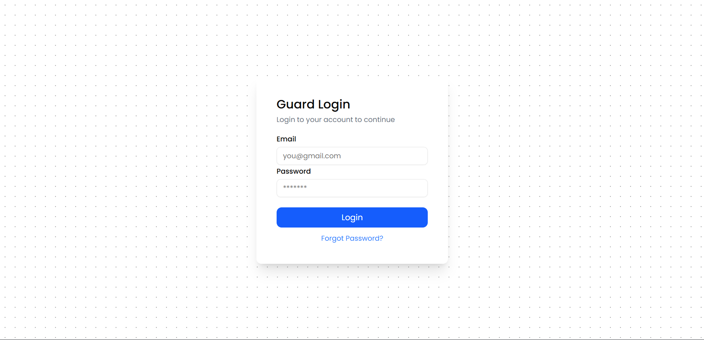
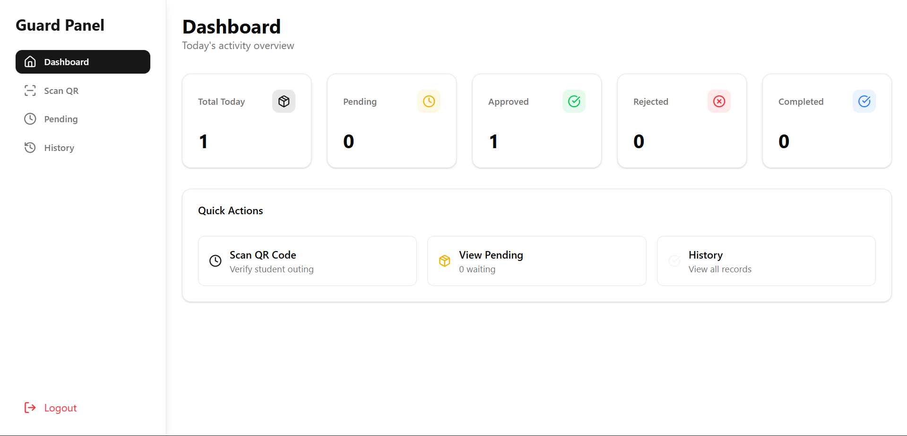
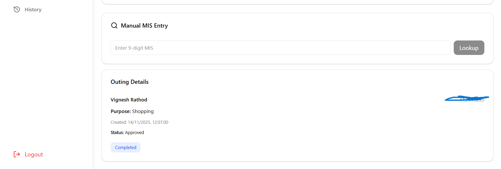
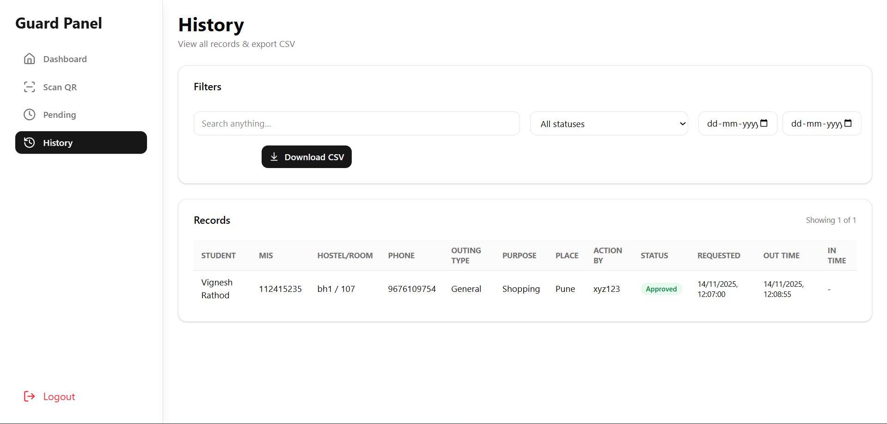

# Outing System

Compact outing-management application with student and guard frontends and an Express + MongoDB backend.
Actually built for college outing management but can be adapted for other uses.
[Demo video (YouTube)](https://youtu.be/NLlE6XnnyJc)  

Badges
- Build: 
- License: 

---

## Quick links
- Student frontend: frontend/studentview
- Guard frontend: frontend/guardView
- Backend: backend

---

## Screenshots / Images









---


## Features
- Student: signup, login, onboard, create outing, generate QR, view history.
- Guard: login, scan QR or manual MIS lookup, approve/reject/complete outings, filter & sort outings.
- Backend: Express APIs, MongoDB models, cookie-based JWT auth, email verification.

---

## Environment variables

Backend: `backend/.env` (example)
```
PORT=5000
NODE_ENV=production
MONGODB_URI=mongodb://<user>:<pass>@host:port/outingSystem
JWT_SECRET=REPLACE_WITH_SECURE_SECRET
FRONTEND_URL=http://localhost:5173
EMAIL_HOST=smtp.example.com
EMAIL_PORT=587
EMAIL_USER=you@example.com
EMAIL_PASS=your_email_password
EMAIL_FROM="Outing System <no-reply@example.com>"
```

Frontends: `frontend/*/.env`
```
VITE_API_URL=http://localhost:5000/api/v1
VITE_NODE_ENV=development
```

Do NOT commit secrets.

---

## Local development

1. Backend
```bash
cd backend
npm install
npm run dev
```

2. Student frontend
```bash
cd frontend/studentview
npm install
npm run dev
```

3. Guard frontend
```bash
cd frontend/guardView
npm install
npm run dev
```

Open student app at http://localhost:5173 (default Vite port) or check configured ports.

---

## Production / Docker (quick)
- Build backend and frontends, serve frontend static build with nginx.
- Use docker-compose to inject env vars securely.

---

## API overview (selected)
Base path: `/api/v1`

Student
- POST `/student/signup`
- POST `/student/login` (sets httpOnly cookie)
- POST `/student/outing/add`
- GET `/student/outing/history`

Guard
- POST `/guard/login`
- GET `/guard/check-auth`
- GET `/guard/outings` (filters: status, search, startDate, endDate)
- GET `/guard/outing/:id`
- POST `/guard/approve` — body: `{ data: { _id } }`
- POST `/guard/reject` — body: `{ data: { _id } }`
- POST `/guard/complete` — body: `{ data: { _id } }`

---

## Recommended images to add (manifest)
See `docs/IMAGES.md` for names and descriptions. Add your screenshots and the demo video thumbnail to `docs/images/`, then the images will render in this README.

---

## Contributing
- Create a branch per feature.
- Run linters & tests before PR.
- Keep secrets out of PRs.

---

## License
MIT
